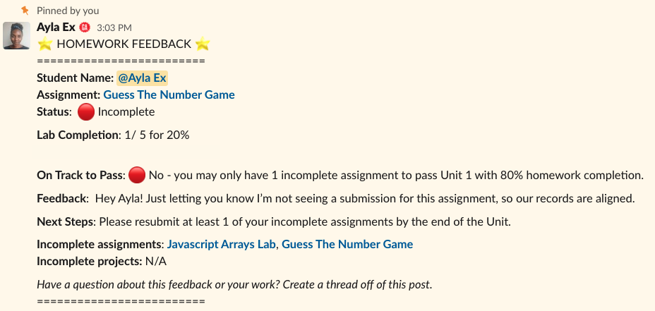

<h1>
  <span class="headline">Instructional Associate Guide</span>
  <span class="subhead">Homework Feedback</span>
</h1>

## Due-Day Workflow

Use this workflow every day an assignment is due.

## By 10:00 AM

Check the homework submission form.

For each student who did **not** submit:

1. Mark the assignment incomplete in the Course Tracker.
2. Enter a 0 for that assignment.
3. Send the homework feedback message immediately.

Do not wait until all grading is finished.

The missing-work message should happen early so the student can see how the missing assignment affects their progress.

## After Missing Work Is Recorded

Spend the rest of the morning reviewing submitted work.

For each submitted assignment:

- Check whether the main requirements are complete.
- Mark the assignment complete or incomplete.
- Send the homework feedback message.
- Add short feedback when useful.

Feedback can be brief.

Examples:

- Great work!
- Nice job completing the requirements.
- Good effort. Review the instructions again and resubmit the missing section.
- Your repo link is missing. Please reply with the correct link.

## Homework Feedback Template

Use this template for every graded homework assignment.

```text
:star: HOMEWORK FEEDBACK :star:
=========================

Student Name: @student

Assignment:

Grade: :+1: :-1:

Lab Completion: 0 / 20 for 0%

On Track to Pass: :white_check_mark: :x:

Feedback:

Next Steps:

Incomplete assignments:

Incomplete projects:

Have a question about this feedback or your work?
Reply to this post.

=========================
```

## Complete Assignment Example


## Missing Assignment Example



## What Counts as Useful Feedback?

Useful feedback tells the student what to keep doing or what to fix next.

Keep it short. One or two sentences is enough for most homework.

## If You Are Unsure How to Grade

Do not guess silently.

Instead:

1. Add a note in the instructional channel.
2. Ask the lead instructor to confirm.
3. Update the student once the decision is clear.
